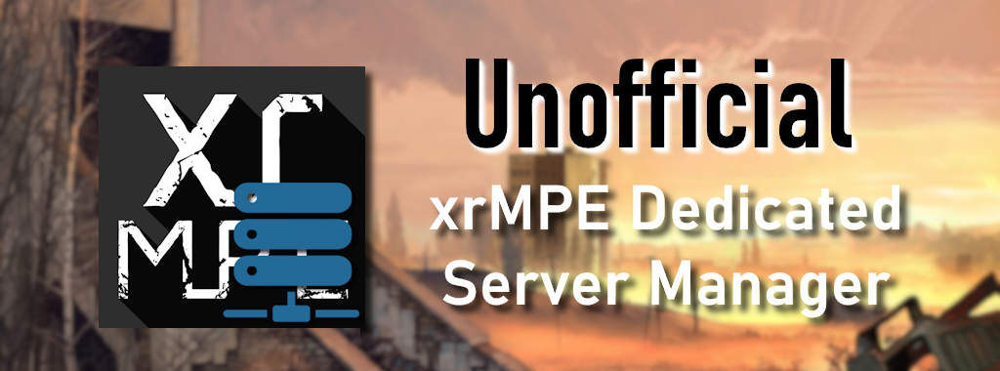
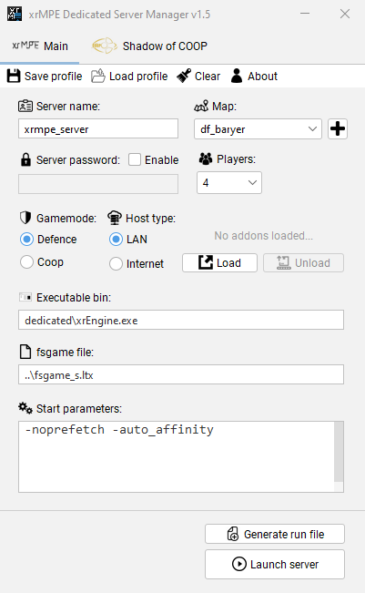

# Unofficial xrMPE Dedicated Server Manager

- **Author:** Rammaken
- **Latest version:** 1.3
- **Programming Language:** Java

# Brief
A simple, portable, lightweight and open source GUI app that lets you create and automatically generate a custom dedicated server run file for xrMPE mod.
Specially designed to make editing dedicated server more easir and noob-friendly.

# Features
- Creates a run file automatically, no need for manual editing in notepad.
- Highly customizable, change map, exe bin, game mode, password, etc.

# Requeriments
Needs Java Runtime Environment 1.8 to run the app.
https://www.java.com/es/download/ie_manual.jsp

# How-to-build
Needs Apache Netbeans IDE to open, edit and compile the project.
https://netbeans.apache.org/download/index.html
